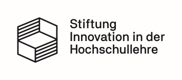

======
PyRope
======

PyRope is a Python package for creating randomised (electronic) assessment
exercises and for running them in different contexts. It is especially
designed for the needs in science, technology, engineering and mathematics
(STEM), but not limited to these domains.

In contrast to classical e-assessment systems, PyRope's philosophy is:

  Coding, not clicking.

Someone who wants to develops an exercise should spend his or her time on the
didactical design, not on the process of getting it into the system. Treating
exercises as source code allows one to benefit from well established software
developing tools and principles and therefore help to:

* develop exercises more efficiently.
* use a familiar integrated development environment (IDE).
* improve documentation.
* spot and fix bugs.
* share exercise pools as open educational ressources (OER).
* better understand exercises authored by others.
* make exercises easily accessible to automated analyses.
* increase confidence in the e-assessment system.

Design Principles
=================

* **Simplicity** - Creating exercises should make fun. PyRope aims for simple
  and fast exercise coding, even for users inexperienced with Python.
* **Python** - With PyRope, you have the full power of Python at hand to
  create elaborate exercises, limited only by your creativity.
* **Flexibility** - PyRope not only allows you to easily adapt available
  exercises, but also to create your own, new exercise formats.
* **Collections** - Be it from your personal fund or from public sources,
  PyRope lets you compile new exercise collections by selection, aggregation
  and filtering mechanisms.
* **Autonomy** - You can run PyRope locally, without the need of a database, a
  remote server or a learning management system. This is particularly
  interesting for students who want to practice in private, without the fear
  of being tracked permanently.
* **Modularity** - The modular design of PyRope allows different user
  frontends and (in the future) database backends.
* **Open Source** - PyRope is open source and licensed under the `GNU Affero
  General Public License <https://www.gnu.org/licenses/agpl-3.0.en.html>`_.
  You are free to run, study, share and modify the source code, provided you
  distribute derived versions under the same license terms.

To keep PyRope simple, it does not:

* tie to a Learning Management System (LMS).
* provide user or course management.
* provide tools for analysing stored user data.
* allow exercises with branched control flow.

Features
========

* short exercise development cycle using Jupyter Notebooks
* templates in `Markdown <https://www.markdownguide.org/>`_ format
* embedding of images, videos or `LaTeX <https://www.latex-project.org/>`_
* typed input fields
* automatic input validation
* unrestricted use of powerful Python modules, e.g.

  * `Matplotlib <https://matplotlib.org/>`_ for dynamic generation of diagrams
    and images
  * `Sympy <http://sympy.org/>`_ for symbolic manipulation
  * `NumPy <https://numpy.org/>`_ and `SciPy <https://scipy.org/>`_ for numeric
    computation
  * `Pandas <https://pandas.pydata.org/>`_ for incorporating external data

* sophisticated manual and auto scoring
* programmable individual feedback
* unit testing of exercises for common errors like missing or inappropriate
  treatment of trivial user input
* Jupyter Notebook based frontend with

  * flexible layout formatting via cascading style sheets
  * configurable input widgets
  * instantaneous visual feedback on invalid user input

* numerous configuration options

Disclaimer
==========

This package is still in a very early stage of development and therefore
subject to heavy changes.  Please do not rely on stability or continuity yet,
especially not in exam contexts.

Download and installation
=========================

Requirements
------------

* `Python3 <https://www.python.org/downloads>`_ version 3.10 or higher and pip,
  which is a built-in package
* `Git client <https://git-scm.com/downloads>`_
* `Pandoc <https://pandoc.org/installing.html>`_ for converting exercise
  templates. The required version depends on :code:`nbconvert`. PyRope uses
  :code:`nbconvert 7.16.4` which requires >= 2.9.2 and < 4.0.0.
* If you are using a virtual environment, make sure that Pandoc is installed
  in it.
* PyRope does not support Notebook 7 and JupyterLab yet.

Windows
-------

.. code-block:: sh

  python -m pip install git+https://github.com/PyRope-E-Assessment/pyrope.git

Linux
-----

.. code-block:: sh

  python3 -m pip install git+https://github.com/PyRope-E-Assessment/pyrope.git

Quick start
===========

Windows
-------

.. code-block:: sh

  python -m pyrope run

Linux
-----

.. code-block:: sh

  python3 -m pyrope run

Documentation
=============

* `Documentation for learners <docs/doc-learners.rst>`_
* `Documentation for instructors <docs/doc-instructors.rst>`_
* `Documentation for developers <docs/doc-developers.rst>`_

Contribution
============

You can contribute to this project in several ways:

* Tell us your user experience.
* Create your own exercises or exercise pools and make them public.  Send us a
  reference if you do so.
* Find bugs and report them in our bug tracker.
* Request features you would like to see in the next version.
* Participate in the development of the code base.

Contact
=======

Software development:

* Konrad Schöbel <konrad.schoebel@htwk-leipzig.de>
* Paul Brassel <paul.brassel@htwk-leipzig.de>

Exercise pools:

* Jochen Merker <jochen.merker@htwk-leipzig.de>
* Heike Hain <heike.hain@htwk-leipzig.de>

Acknowledgements
================

This project is developed at the HTWK Leipzig University of Applied Sciences
and funded by the "Stiftung Innovation in der Hochschullehre".

