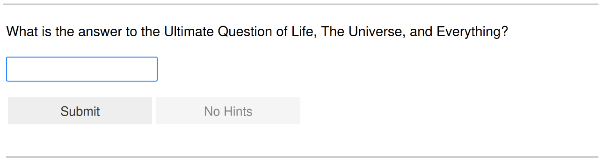

**********
Quickstart
**********

The following examples serve to get a glimpse on how exercises are modelled in
PyRope. For an extensive introduction with detailed explanations, please refer
to the sections on :doc:`exercises` and :doc:`running` exercises.

We recommend to develop exercises interactively within a Jupyter Notebook.
This is by far the simplest and fastest way, as it allows to seamlessly
alternate between writing code and testing it. To follow the examples below,
you must import the PyRope module beforehand.

.. code:: python

    import pyrope

Minimal Example
===============

For simplicity, let us start with a static exercise that has single input
field with a fixed answer. Copy the following code into a Notebook cell and
execute it by pressing ``Shift+Enter``.

.. code:: python

    class FortyTwo(pyrope.Exercise):

        def problem(self):
            return pyrope.Problem('''
                What is the answer to the Ultimate Question of Life, The Universe,
                and Everything?

                <<answer>>
                ''',
                answer=pyrope.Natural()
            )

        def the_solution(self):    # prefix 'the_' indicates uniqueness
            return 42

This *defines* the exercise. To see if it *runs* as expected, execute the
following cell.

.. code:: python

  FortyTwo().run()

To rerun the exercise, simply execute the cell again. If you are not
satisfied, you can go back, edit the code in the exercise definition and then
run the exercise again to see the effect of your changes.

Scoring
=======

Observe that we do not need to implement a method to score the answer in the
example above. This is because PyRope has an auto-scoring mechanism, which by
default awards one point if the answer is correct and zero if not. The
correctness of the answer is deduced from comparing it to the given sample
solution. If you are not satisfied with the auto-scoring, you can implement
your own as follows.

.. code:: python

    class FortyTwo(pyrope.Exercise):

        def problem(self):
            return pyrope.Problem('''
                What is the answer to the Ultimate Question of Life, The Universe,
                and Everything?

                <<answer>>
                ''',
                answer=pyrope.Natural()
            )

        def scores(self, answer):
            if answer == 42:
                return 100
            else:
                return 0

        def the_solution(self):
            return 42

In the example above we still need to provide a sample solution. This is
because the auto-scoring will deduce the maximal score from it. Omitting the
sample solution will result in an error when submitting the answer, since
PyRope cannot determine the maximal score.

.. code:: text

    ---------------------------------------------------------------------------
    IllPosedError                             Traceback (most recent call last)

    [...]

    IllPosedError: Unable to determine maximal score for input field 'answer'.

Alternatively, the maximal score can be given explicitly by returning a pair
instead of a single number from the :py:meth:`scores` method.

.. code:: python

    class FortyTwo(pyrope.Exercise):

        def problem(self):
            return pyrope.Problem('''
                What is the answer to the Ultimate Question of Life, The Universe,
                and Everything?

                <<answer>>
                ''',
                answer=pyrope.Natural()
            )

        def scores(self, answer):
            if answer == 42:
                return (100, 100)  # read "100 of 100"
            else:
                return (0, 100)  # read "0 of 100"

Sample Solution
===============

Notice that in the above example the learner does not get the correct solution
as feedback for a wrong answer. This is why you should always implement a
sample solution. After all, if you can not provide a solution, why should
your students?

A unique sample solution is provided via the method :py:meth:`the_solution` as
above. If the solution is not unique, you must use :py:meth:`a_solution`
instead.

.. code:: python

    class Factor(pyrope.Exercise):

        def problem(self):
            return pyrope.Problem(
                'Give a non-trivial divisor of 42: <<answer>>',
                answer=pyrope.Integer(minimum=2, maximum=41)
            )

        def scores(self, answer):
            return 42 % answer == 0

        def a_solution(self):  # prefix 'a_' indicates non-uniqueness
            return 7

In this case we still need to implement the :py:meth:`scores` method.
Otherwise the auto-scoring cannot determine the correctness of the answer and
raises an error when submitting the exercise.

.. code:: text

    ---------------------------------------------------------------------------
    IllPosedError                             Traceback (most recent call last)

    [...]

    IllPosedError: Automatic scoring for input field 'answer' needs a unique sample solution.

Randomisation
=============

Randomised parameters can be generated in the :py:meth:`parameters` method
and then used in all other methods.

.. code:: python

    import random

    class Product(pyrope.Exercise):

        def parameters(self):
            return dict(
                a=random.randint(2, 9),
                b=random.randint(2, 9),
            )

        def problem(self, a, b):
            return pyrope.Problem(
                'The product of <<a>> and <<b>> is <<answer>>.',
                answer=pyrope.Natural()
            )

        def the_solution(self, a, b):
            return a * b

Implicit solution
=================

Often the sample solution is one of the parameters. In this case, there is
no need to implement a sample solution or a scoring method. Instead, you can
indicate that an input field has a particular parameter as correct answer by
appending an underscore to the parameter name and let PyRope do the rest.

.. code:: python

    import random

    class Product(pyrope.Exercise):

        def parameters(self):
            a = random.randint(2, 9)
            b = random.randint(2, 9)
            return dict(a=a, b=b, product=a*b)

        def problem(self, a, b):
            return pyrope.Problem(
                'The product of <<a>> and <<b>> is <<product_>>.',
                product_=pyrope.Natural()
            )

For input fields using this naming convention, the solution is assumed to be
unique. This is why PyRope here automatically inserts the sample solution
into the feedback.

Feedback
========

Apart from the sample solution, which is given automatically, you can give
individual feedback based on the parameters and the learner's answers via the
:py:meth:`feedback` method.

.. code:: python

    class Apples(pyrope.Exercise):

        def problem(self):
            return pyrope.Problem(
                '''
                If there are five apples and you take away three,
                how many do you have?

                <<number>>
                ''',
                number=pyrope.Natural()
            )

        def the_solution(self):
            return 3

        def feedback(self, number):
            if number == 3:
                return "Be honest: You knew the quiz, didn't you?"
            return 'You took three apples, so you have three!'

Multiple input fields
=====================

If the exercise has more than one input field, then the scores for each input
field can be returned in a dictionary. The same holds for the/a sample
solution.

.. code:: python

    import random

    class SumAndProduct(pyrope.Exercise):

        def parameters(self):
            a = random.randint(1, 9)
            b = random.randint(1, 9)
            return dict(a=a, b=b)

        def problem(self):
            return pyrope.Problem('''
                * The sum of <<a>> and <<b>> is <<the_sum>>.
                * The product of <<a>> and <<b>> is <<product>>.
                ''',
                the_sum=pyrope.Natural(),
                product=pyrope.Natural(),
            )

        def scores(self, a, b, the_sum, product):
            scores = dict(the_sum=0, product=0)
            if the_sum == a + b:
                scores['the_sum'] = 1
            if product == a * b:
                scores['product'] = 2
            return scores

        def the_solution(self, a, b):
            return dict(the_sum=a+b, product=a*b)

In cases where it is not possible to score input fields individually, you can
return an overall score from the :py:meth:`scores` method.

.. code:: python

    import random

    class Factorisation(pyrope.Exercise):

        def parameters(self):
            a = random.randint(2, 9)
            b = random.randint(2, 9)
            return dict(a=a, b=b, product=a*b)

        def problem(self, product):
            return pyrope.Problem(
                r'<<product>> = <<a_>> $\times$ <<b_>>',
                a_=pyrope.Integer(minimum=2),
                b_=pyrope.Integer(minimum=2),
            )

        def scores(self, product, a_, b_):
            return a_ * b_ == product

Hints
=====

Depending on the configuration, the learner can request one or more hints
when stuck with the solution of an exercise. These are provided by the
:py:meth:`hints` method.

.. code:: python

    class HelpMe(pyrope.Exercise):

        def problem(self):
            return pyrope.Problem('''
                What is the answer to the Ultimate Question of Life, The Universe,
                and Everything?

                <<answer>>
                ''',
                answer=pyrope.Natural()
            )

        def the_solution(self):
            return 42

        def hints(self):
            yield 'It is a natural number.'
            yield 'You can find it in the "Hitchhiker\'s Guide to the Galaxy".'

Unit testing
============

Examples may contain inconsistencies, for instance when providing both, a
maximal score and a sample solution, as in the following example.

.. code:: python

    import random

    class SmallestPrime(pyrope.Exercise):

        def problem(self):
            return pyrope.Problem(
                r'What is the smallest prime number? <<answer>>',
                answer=pyrope.Natural()
            )

        def scores(self, answer):
            if answer == 2:
                return (1, 1)
            return (0, 1)

        def the_solution(self):
            return 1  # should be two

To avoid this and other common mistakes, you can let PyRope run a couple of
automated tests on an exercise.

.. code:: python

    SmallestPrime().test()

.. code::

    .........F...............
    ======================================================================
    FAIL: test_maximal_total_score_for_sample_solution (pyrope.tests.TestParametrizedExercise.test_maximal_total_score_for_sample_solution) (exercise=<class '__main__.SpotTheError'>)
    ----------------------------------------------------------------------
    Traceback (most recent call last):
      File "~/pyrope/venv/lib/python3.12/site-packages/pyrope/tests.py", line 101, in wrapped_test
        test(self, pexercise)
      File "~/pyrope/venv/lib/python3.12/site-packages/pyrope/tests.py", line 399, in test_maximal_total_score_for_sample_solution
        self.assertEqual(
    AssertionError: 0.0 != 1.0 : The sample solution does not get maximal total score.

    ----------------------------------------------------------------------
    Ran 25 tests in 0.045s

    FAILED (failures=1)

This helps to avoid exceptions during exercise runs and to gain confidence in
third party exercises obtained from foreign sources.
